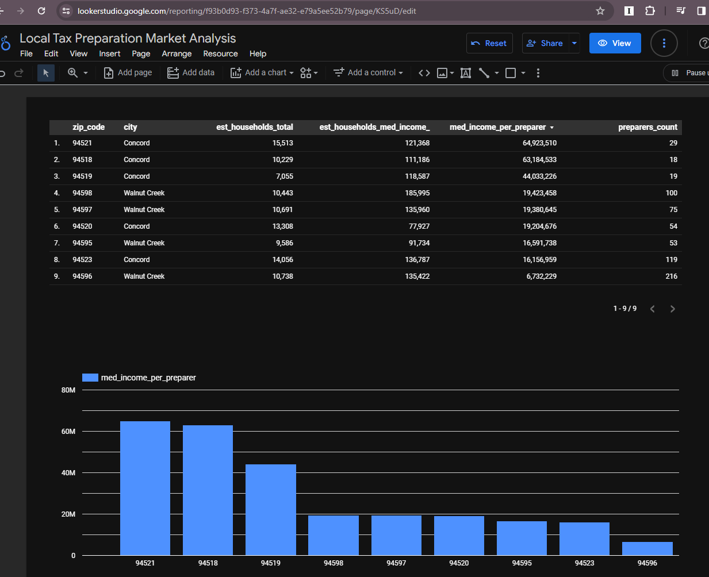

# California tax preparers local market analysis 

## Introduction

This is the final project for [Data Engineering Zoomcamp 2024](https://github.com/DataTalksClub/data-engineering-zoomcamp).

## Problem description

This is a proof-of-concept project to build a data engineering infrastructure that would execute a pipeline from downloaded datasets to an analytical dashboard.

Back in 2018, I had a client on Upwork that commissioned a web scraping script to download US tax preparer data from the  [Directory of Federal Tax Return Preparers with Credentials and Select Qualifications](https://irs.treasury.gov/rpo/rpo.jsf). That script involved a lengthy process facilitated by Selenium driving foreground Chrome sessions. I had an idea to use that dataset for this project combining it with [US Census: Income in the Past 12 Months (in 2022 Inflation-Adjusted Dollars)](https://data.census.gov/table?q=median%20income&g=010XX00US$8600000&y=2022) to build a dashboard that would analyze the potential market for tax preparers in California.

Because the initial process of obtaining these datasets is quite interactive, for this exercise I saved raw datasets into a separate public repository: [US Tax Preparers Dataset](https://github.com/pavlokurochka/us_tax_preparers).

## Technologies

- **Cloud**: GCP: Compute Engine VM.

- **Infrastructure as code (IaC)**: Terraform, Docker.

- **Workflow orchestration**: Kestra.

- **Data Warehouse**: BigQuery (mock-up development in DuckDB).

- **Batch processing**: SQLMesh, Python.

- **Dashboard**: Looker Studio.


## Data ingestion (batch) & Workflow orchestration

The pipeline runs in a single Kestra flow in a Kestra docker container that runs on a Compute Engine VM.


### Transformations  tasks description

- **get_zipfile** download source repo in .zip file.
- **unzip** all files from downloaded .zip file.
- **parquet_output** with Python script open source .csv files, remove unneeded columns, save to .parquet files.
- **parallel_upload_parquet_to_cloud_storage** upload .parquet files to the GCS bucket.
- **parallel_bigquery_build_external_table** create BigQuey external tables based on uploaded .parquet files in the GCS bucket.
- **git_clone** clone this repo inside the Kestra docker container.
- **create_secret_file** create the GCP secret file inside Kestra docker container to be used by SQLmesh.
- **sqlmesh_apply** run SQL transformations in SQLmesh.

## Transformations (SQLMesh, Python.)

- Used Python to remove unused columns and SQLMesh to create staging views (the idea is to process anything there) and finally a fact view named households_per_preparer_ca.

  

## Dashboard

- Used Google Data Studio to visualize data and create 2 tiles. Visit [Local Tax Preparation Market Analysis](https://lookerstudio.google.com/s/pjejiDvpkf8).

# How to reproduce the project

## Setup Cloud & IaC tools (Terraform, Docker)

**Create a new Google Cloud project named *de-zoomcamp-preparer* (keep the name the same, otherwise it won't work)**

Go to `Compute Engine` and enable it.

Go to [IAM & Admin>Service Accounts ](https://console.cloud.google.com/iam-admin/serviceaccounts?project=de-zoomcamp-preparer). Click on account email. Go to Keys. Add Key. Choose: Create New Key>JSON. Note where file got downloaded.

Go to [IAM & Admin ](https://console.cloud.google.com/iam-admin/iam?project=de-zoomcamp-preparer)

- Go to the *IAM* section of *IAM & Admin* https://console.cloud.google.com/iam-admin/iam

- Click the *Edit principal* icon for your service account.

- Add these roles in addition to *Viewer* : **Storage Admin** +  **BigQuery Admin**  +  **Compute Admin**

  

Clone this project

```bash
git clone https://github.com/pavlokurochka/data-engineering-zoomcamp2024-project.git

cd data-engineering-zoomcamp2024-project
```

Copy the downloaded `.json` file into `secret/gcp_secret.json`

Make sure your `gcloud` SDK is set up: [initial setup](https://github.com/DataTalksClub/data-engineering-zoomcamp/blob/main/01-docker-terraform/1_terraform_gcp/2_gcp_overview.md#initial-setup)

```bash
export GOOGLE_APPLICATION_CREDENTIALS="~/data-engineering-zoomcamp2024-project/secret/gcp_secret.json"

gcloud auth application-default login
```

Make sure your Terraform is configured: [terraform_gcp](https://github.com/DataTalksClub/data-engineering-zoomcamp/tree/main/01-docker-terraform/1_terraform_gcp)

Now, navigate to ~/data-engineering-zoomcamp2024-project/terraform

``` bash
cd ~/data-engineering-zoomcamp2024-project/terraform/
terraform init
terraform plan
terraform apply
```

### Connect to VM from your PC

In your local machine create a /.ssh/config file

```
mkdir .ssh
touch config
```

and place the below lines into it. Replace my name with yours. Look up the external IP for your [VM](https://console.cloud.google.com/compute/instances?project=de-zoomcamp-preparer&supportedpurview=project).

```
Host de-zoomcamp-preparer
    Hostname external_ip_of_your_vm
    User pavlo
    RemoteForward 52698 localhost:52698
    IdentityFile ~/.ssh/gcp_pavlo
    LocalForward 8080 localhost:8080
    LocalForward 5432 localhost:5432
    LocalForward 8888 localhost:8888
    LocalForward 4200 localhost:4200
    LocalForward 4040 localhost:4040
```

Create SSH connection from your PC to the newly created VM
(Leave passphrase empty for simplicity)

```
cd .ssh
ssh-keygen -t rsa -f gcp_pavlo -C pavlo -b 2048
cat gcp_pavlo.pub
```

Copy and paste the output to 
https://console.cloud.google.com/compute/metadata?project=de-zoomcamp-preparer&supportedpurview=project&tab=sshkeys. 

You can now connect to the Google Cloud VM from your terminal with

```
ssh de-zoomcamp-youtube
```

YOU ARE NOW LOGGED IN THE VM MACHINE. Run everything there. 

I prefer using VS Code to access the VM. Make sure you have `Remote - SSH` extension installed. Copy `config` file above into the `.ssh` directory above. Then copy `.ssh` directory to the home directory of your PC.


Open remote host in VS Code

 

Open the terminal in this window of VS Code. Cloud Compute VM already has git. Clone this project in VM.

```bash
git clone https://github.com/pavlokurochka/data-engineering-zoomcamp2024-project.git

cd data-engineering-zoomcamp2024-project
```

Copy locally downloaded `.json` file into `secret/gcp_secret.json` in VM.


Install Docker

```bash
cd vm_setup
chmod +x install_docker.sh
./install_docker.sh
```

In Compute Engine Stop and Start your [VM](https://console.cloud.google.com/compute/instances?project=de-zoomcamp-preparer&supportedpurview=project). This enables docker to run without `sudo`. Double check the external IP. Update your local `config` file  if needed. Connect back your VS Code to remote host `de-zoomcamp-preparer`. Compose and execute Ketra docker container.

```bash
export SECRET_GCP_CREDS="$(base64 -w 0 secret/gcp_secret.json)"
docker compose up
```

Open Kestra UI in your local browser `http://localhost:8080/` . Lookup login and password in `docker-compose.yml` .

Go to Flows. Click [Import]. Import `kestra\flows.zip` from your local repo directory.

Execute preparers Flow.

# Dashboard

I have used Google Data Studio to create a dashboard on top of the SQLMesh models. You can either create your dashboard or just view my dashboard [here](https://lookerstudio.google.com/s/pjejiDvpkf8).

Here's a screenshot of my dashboard in case you're having any trouble viewing it:



I hope you like it. If you have any questions about the project, face any problems while following along, or have a suggestion for me, feel free to comment or drop me a DM on  [Linkedin](https://www.linkedin.com/in/kurochka/).

Special thanks 

[Aditya Gupta for yelposphere](https://github.com/itsadityagupta/yelposphere/tree/main) - re-used his documentation structure and some setup steps.

Michael Shoemaker @dataslinger6379 for Kestra videos

https://www.youtube.com/watch?v=Jfa4jtLOnIs&t=2076s

https://www.youtube.com/watch?v=hyTYC54tx0I&t=1873s

[typora.io](https://typora.io/) for an editor that made these readmes much easier to write.

